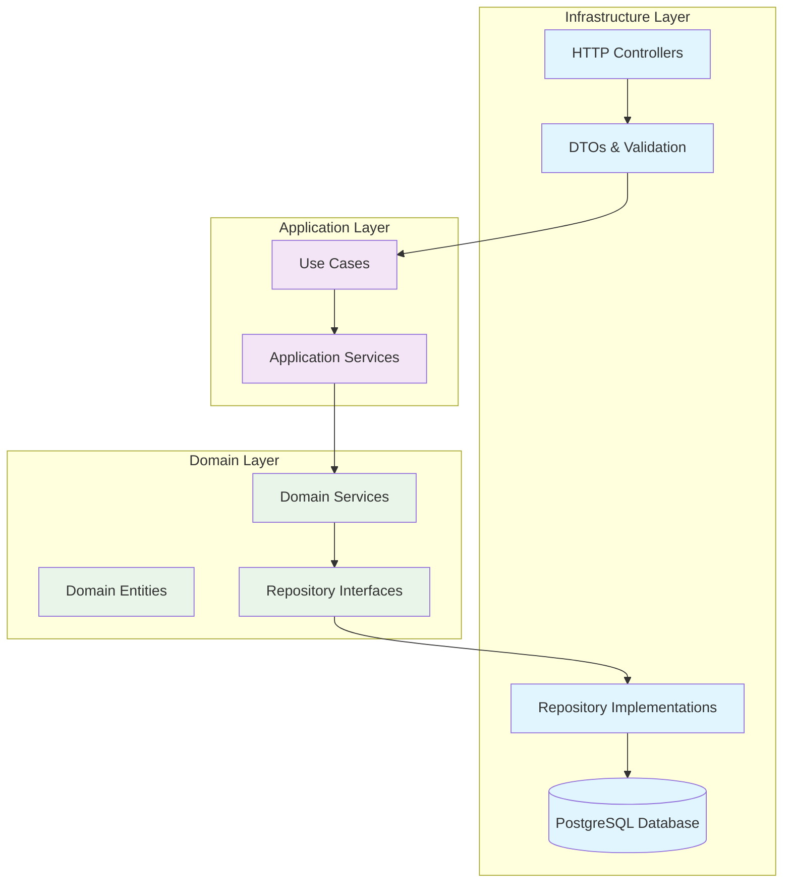
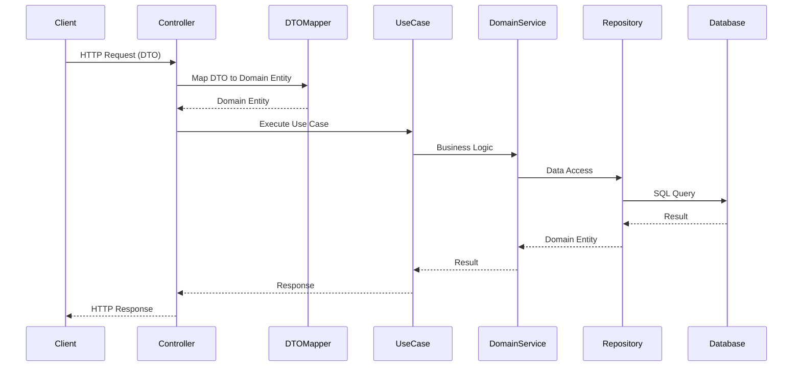
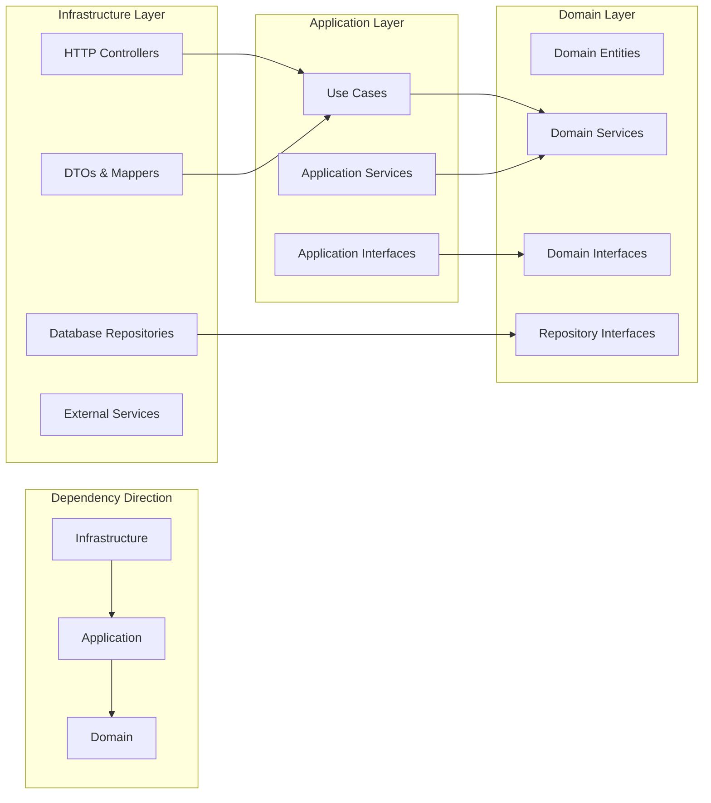
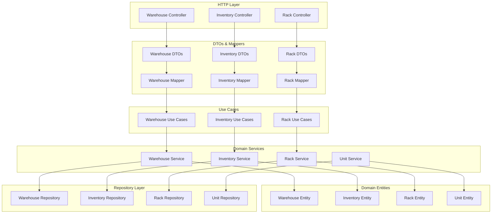
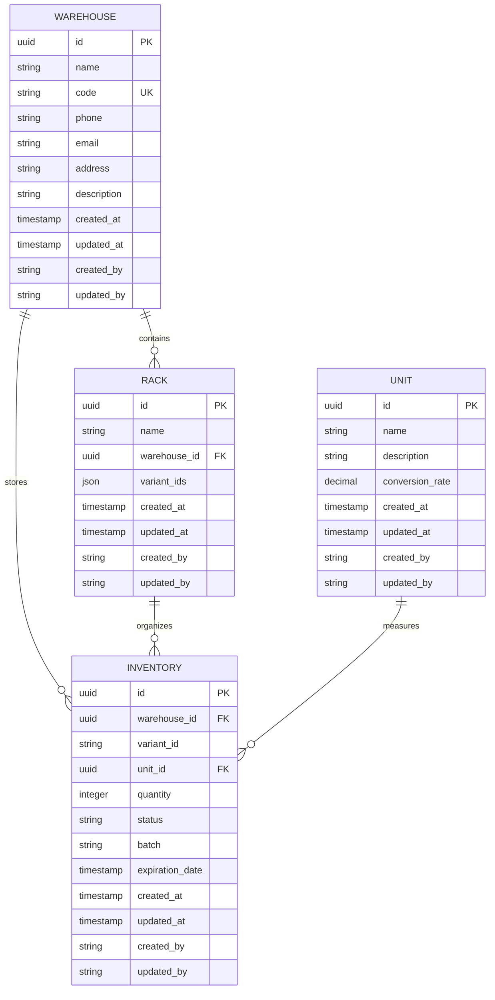
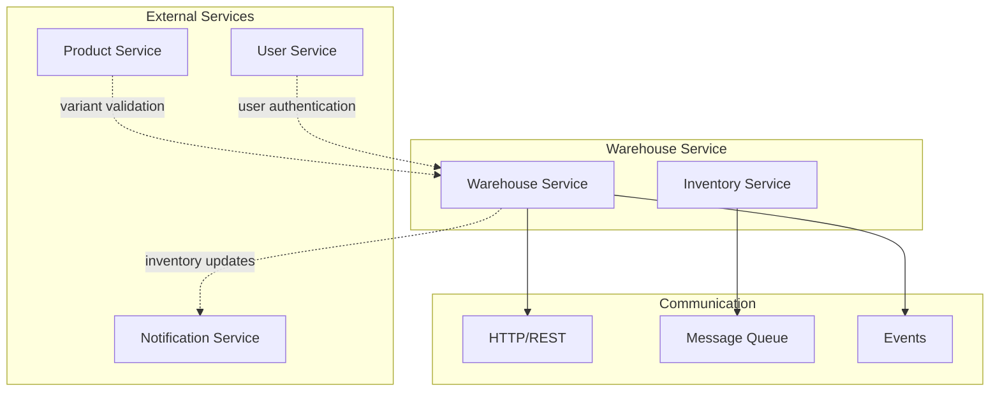
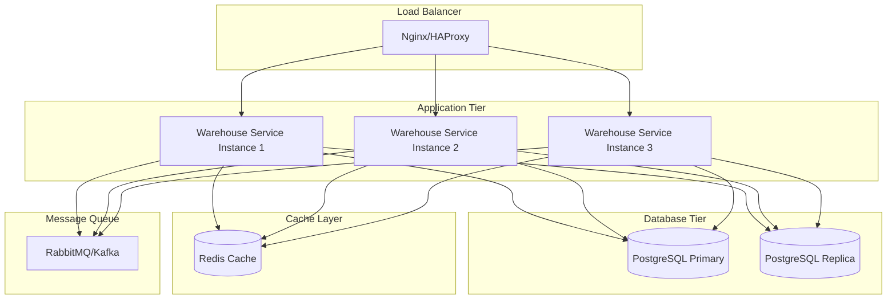
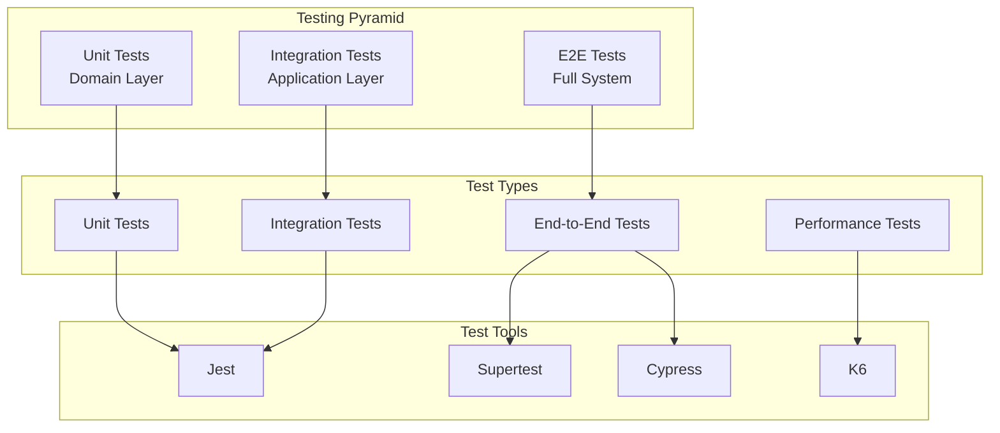
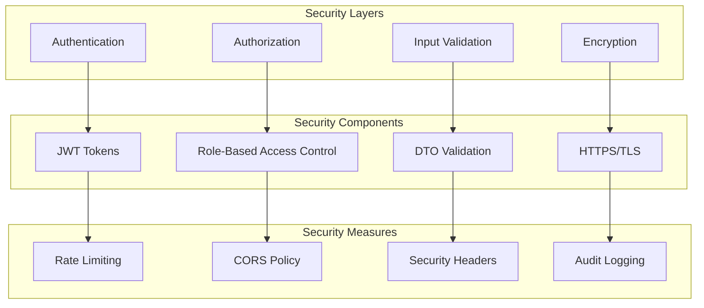

# Architecture Diagrams

## Clean Architecture Overview

## Data Flow Diagram

## Layer Dependencies

## Warehouse Service Components

## Database Schema

## Service Integration

## Deployment Architecture

## Testing Strategy

## Security Architecture

These diagrams provide a comprehensive view of the warehouse service architecture, showing how Clean Architecture principles are applied and how different components interact with each other.
